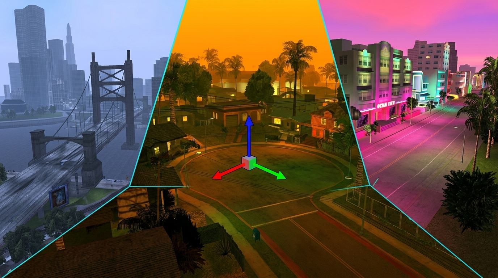

# Ariane

[](https://www.youtube.com/watch?v=jJipK1woGAk)

**[Watch the complete Ariane walkthrough on YouTube →](https://www.youtube.com/watch?v=jJipK1woGAk)**

Ariane is a map viewer and editor for Grand Theft Auto III, Vice City and San Andreas, built on [librw](https://github.com/Southland-FR/librw) and based on aap's euryopa.

[Download the latest release](https://github.com/Dryxio/ariane/releases/latest) · [Join the Discord](https://discord.gg/8NS59AbQtN)

## Features

### Map editing

- Place, move, rotate and delete map objects, with brush placement for repeated objects
- Select individual objects or whole areas, then translate and rotate them with 3D gizmos
- Use grid and angle snapping, align objects to the ground, and snap them to nearby surfaces
- Copy, cut and paste selections—including paste in place—with undo and redo support

### Object Browser and prefabs

- Browse objects in list or thumbnail views, with categories, IDE filters, search and favorites
- Preview models in 3D before placing them
- Build reusable prefabs from map selections, then browse, import and place them as a group
- Import custom DFF models and TXD textures

### Saving and iteration

- Save to original game files or keep edits isolated in a modloader/Ariane destination
- Write text or binary IPL data and update IMG archives
- Review changes made since the last save and recover work from automatic backups
- Test San Andreas maps in game and hot-reload supported changes with `ariane.asi`

### World tools

- Edit San Andreas water and path nodes
- Control time, weather, rendering distance and post-processing while you work
- Inspect collisions, zones, object information and other map data

## Download and usage

Download a current build from [GitHub Releases](https://github.com/Dryxio/ariane/releases/latest), place it in a supported GTA game directory and run it. Ariane automatically detects GTA III, Vice City or San Andreas.

The San Andreas test-in-game and hot-reload workflows require `ariane.asi`. Hot reload has limitations for streamed binary maps; see the in-app guidance for the current behavior.

For development updates, support and community downloads, [join the Ariane Discord](https://discord.gg/8NS59AbQtN).

### Linux runtime requirements

The Linux release ships the windowing library it needs in a `lib/` directory next
to the `ariane` binary, so extracting the tarball is normally all you need. The
graphics stack is expected from your system, so make sure it is present
and current:

```bash
sudo apt-get install libgl1      # Debian / Ubuntu
```

If you build with `--gfxlib=sdl2`, `libSDL2-2.0` is bundled instead. If you
rebuild the binary yourself with the system GLFW, install the runtime package
(`libglfw3`, not `libglfw3-dev`) or the loader will report
`error while loading shared libraries: libglfw.so.3`.

To see whether anything else is still unresolved:

```bash
ldd ./ariane | grep 'not found'
```

#### Wayland and X11

The bundled GLFW is built with **both** the X11 and Wayland backends, so the same
binary works under either. It picks one automatically, and you can override the
choice with `XDG_SESSION_TYPE`:

```bash
./ariane                        # auto-detect (Wayland preferred when available)
XDG_SESSION_TYPE=wayland ./ariane   # force native Wayland
XDG_SESSION_TYPE=x11 ./ariane       # force X11 / XWayland
```

There is no `GLFW_PLATFORM` environment variable — `GLFW_PLATFORM` is a C init
hint, and setting it in the environment has no effect.

GLFW `dlopen`s the backend libraries at runtime rather than linking them, which
means `ldd ./ariane` will **not** list them even when they are missing. If you
force Wayland, install the libraries it will look for:

```bash
sudo apt-get install libwayland-client0 libwayland-cursor0 libwayland-egl1 \
                    libxkbcommon0 libegl1
```

To confirm which backend actually came up, check for a Wayland protocol trace:

```bash
WAYLAND_DEBUG=1 ./ariane 2>&1 | head -20   # trace = native Wayland
```

Note that distribution packages named `libglfw3` and `libglfw3-wayland` are
separate, single-backend builds that conflict with each other. Prefer the bundled
library; if you must use a system one, install the build matching your session
rather than both.

### Release channels

- **master** — the standard and recommended build
- **PE/FLA** — an alternate build for projects that use expanded game limits

## Building from source

Ariane requires [Premake 5](https://premake.github.io/) and the
[`ariane` integration branch of librw](https://github.com/Southland-FR/librw/tree/ariane).
For reproducible release builds, use the exact librw commit pinned as
`LIBRW_REF` in `.github/workflows/build-euryopa.yml`. Set `LIBRW` to that librw
worktree before generating the project.

### Linux

Install the compiler and OpenGL/GLFW development packages. On Ubuntu or Debian:

```bash
sudo apt-get install build-essential libgl1-mesa-dev libglfw3-dev
```

Build librw, then Ariane:

```bash
export LIBRW=/path/to/librw-ariane

(cd "$LIBRW" && premake5 gmake2)
CXXFLAGS=-std=c++14 make -C "$LIBRW/build" -j2 \
  config=release_linux-amd64-gl3 librw

premake5 gmake2 --channel=master
make -C build -j2 config=release_linux-amd64-gl3 euryopa
```

Run `bin/linux-amd64-gl3/Release/ariane` with a supported GTA game directory as the current working directory.

### macOS

```bash
export LIBRW=/path/to/librw-ariane
(cd "$LIBRW" && premake5 gmake2 --gfxlib=glfw)

# Apple Silicon
make -C "$LIBRW/build" config=release_macos-arm64-gl3 librw
premake5 gmake2 --channel=master
make -C build config=release_macos-arm64-gl3 euryopa

# Intel
make -C "$LIBRW/build" config=release_macos-amd64-gl3 librw
premake5 gmake2 --channel=master
make -C build config=release_macos-amd64-gl3 euryopa
```

### Windows

Run these commands from a Visual Studio developer shell:

```bat
set LIBRW=C:\path\to\librw-ariane

pushd %LIBRW%
premake5 vs2019
msbuild build\librw.sln /p:Configuration=Release /p:Platform=win-amd64-d3d9 /t:librw /m
popd

premake5 vs2019 --channel=master
msbuild build\librwgta.sln /p:Configuration=Release /p:Platform=win-amd64-d3d9 /t:librwgta;euryopa /m
```

Use `--channel=PE` instead when building the PE/FLA channel.

## License

Because the project depends on LZO (GPL), consider the code in this repository dual-licensed as GPL.

## Credits

- [aap](https://github.com/aap) — original euryopa/librwgta project and librw
